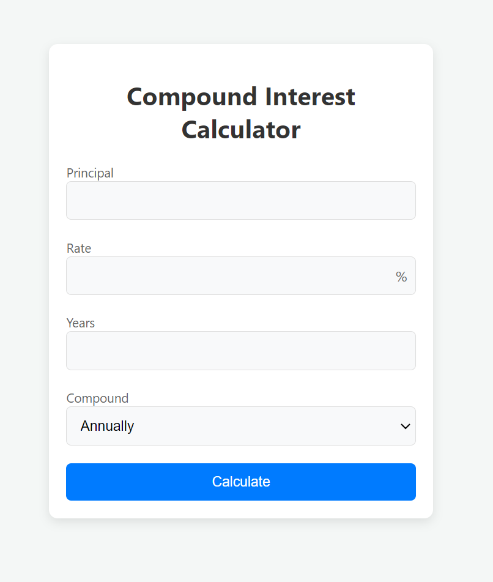

# Compound Interest Calculator

This repository contains a simple yet powerful **Compound Interest Calculator** that helps users calculate compound interest and the total amount based on the following inputs:

- **Principal**: The initial amount of money.
- **Interest Rate**: The percentage rate at which the interest is applied.
- **Time Period**: The number of years the interest is applied for.
- **Compounding Frequency**: Choose from annually, semi-annually, quarterly, or monthly.



## Features:

- **User Inputs**: Users can input the principal amount, interest rate, and time period for which interest is applied.
- **Compounding Frequencies**: Choose how often interest is compounded: annually, semi-annually, quarterly, or monthly.
- **Dynamic Calculations**: Instantly calculate and display the compound interest and total amount based on the provided inputs.
- **Responsive Design**: Built with HTML, CSS, and JavaScript, ensuring compatibility across different devices.
- **Simple UI**: User-friendly interface to help visualize the calculated interest.

## Usage:

1. Clone this repository to your local machine:
   ```bash
   git clone https://github.com/gurgant/compound_interest_calculator.git
   ```
2. Open the `index.html` file in any modern browser.

3. Enter the required values (Principal, Rate, Time, and Compounding Frequency), and click **Calculate** to see the result.

## Demo:

You can also check the live demo hosted with GitHub Pages [here](https://gurgant.github.io/compound_interest_calculator/).

## License:

This project is licensed under the MIT License. See the [LICENSE](LICENSE) file for details.
